# LTI Medialabs UI

## Table of Contents
- [LTI Medialabs UI](#lti-medialabs-ui)
  - [Table of Contents](#table-of-contents)
  - [Project Structure](#project-structure)
  - [Authentication Workflow](#authentication-workflow)
  - [Git Workflow](#git-workflow)
    - [1. Fetch indexes for any updates in remote](#1-fetch-indexes-for-any-updates-in-remote)
    - [2. Create a new branch for development of each feature](#2-create-a-new-branch-for-development-of-each-feature)
    - [3. Commit code to newly created branch](#3-commit-code-to-newly-created-branch)
    - [4. Merge code in `develop` branch](#4-merge-code-in-develop-branch)
  - [IDE Details](#ide-details)
  - [A note on `CHANGELOG.md` Update](#a-note-on-changelogmd-update)

## Project Structure

```
client
╠═ app 
║  ╠═ core
║  ║  ╠═ components
║  ║  ╠═ models
║  ║  ║  ╠═ common
║  ║  ║  ╚═ core
║  ║  ╠═ services
║  ║  ║  ╠═ common
║  ║  ║  ║  ╠═ guards
║  ║  ║  ║  ╠═ interceptors
║  ║  ║  ║  ╚═ services
║  ║  ║  ╚═ core
║  ║  ╚═ state
║  ║     ╠═ actions
║  ║     ╠═ effects
║  ║     ╠═ reducers
║  ║     ╠═ selectors
║  ║     ╠═ types
║  ║     ╚═ index.ts
║  ╚═ shared
║      ╠═ material
║      ╠═ state
║      ╚═ util
║
╠═ angular.json ---------------------------------- | outputPath is changes from dist to public
║
╠═ tsconfig.base.json ---------------------------- | Modified paths to directly point at core and 
║                                                  | feature directories
║ ------------------------------------------------ | Deployment specific files - Do not make changes
╠═ nginx.conf
╠═ Dockerfile
╚═ .dockerignore
```

## Authentication Workflow

|                                       Login                                        |                                        Signup                                        |
| :--------------------------------------------------------------------------------: | :----------------------------------------------------------------------------------: |
|  |  |

*Images generated using [Mermaid](https://mermaid-js.github.io/mermaid-live-editor/)*

##  Git Workflow

### 1. Fetch indexes for any updates in remote

```
git fetch
```

### 2. Create a new branch for development of each feature

- Create a new branch from `develop` from [GitHub](https://github.com/LTIMedialab/medialab-ui/)
```
git fetch
git checkout -b <branch_name>
```
**OR**
- Create a new branch and set upstream to [GitHub](https://github.com/LTIMedialab/medialab-ui/)
```
git checkout -b <branch_name>
git push -u origin <branch_name>
```

### 3. Commit code to newly created branch

- Develop the code
- Ready to commit
```
git commit -m <commit_message>
```

- Get the latest code from existing `develop` branch
```
git pull origin develop
```

- Resolve merge conflicts if any
- Commit when conflicts resolved
```
# Merge into https://remote-url from branch <branch_name>
git commit -m <default_commit_message>
```

- Push to feature branch
```
git push
```

### 4. Merge code in `develop` branch

1. Creating Pull Request
   - Update `CHANGELOG.md` each time
   - `New Pull Request` from [here](https://github.com/LTIMedialab/medialab-ui/pulls)
   - Verify code changes
   - Mention Reviewers
   - Leave a suitable message
   - Done

 Merging the code directly into develop *(not recommended)*
```
git checkout develop
git merge origin/<branch_name>
git push
```

All hail [Linus Torvald](https://github.com/torvalds)!!

##  IDE Details

Microsoft VS Code latest version

| Extension Name           | Publisher                         | Use                                                                     |
| ------------------------ | --------------------------------- | ----------------------------------------------------------------------- |
| Better Comments          | `aaron-bond.better-comments`      | Properly format and style comments in code                              |
| Angular Language Service | `Angular.ng-template`             | Essential extension to highlight Angular related errors in the code     |
| GitLens                  | `eamodio.gitlens`                 | Keep a track of all the activities in repository                        |
| Cloud Code               | `googlecloudtools.cloudcode`      | Integration with Google Cloud Kubernetes Engine and APIs                |
| DocumentThis             | `joelday.docthis`                 | Generate documentation of functions                                     |
| Docker                   | `ms-azuretools.vscode-docker`     | Docker for VS Code                                                      |
| SCSS Formatter           | `sibiraj-s.vscode-scss-formatter` | Because VS Code does not provide a default formatter for `*.scss` files |
| Import Cost              | `wix.vscode-import-cost`          | Use lightweight imports wherever possible                               |
| Markdown All In One      | `yzhang.markdown-all-in-one`      | Format Markdown files in a seamless way                                 |

## A note on `CHANGELOG.md` Update

- Update `CHANGELOG.md` before committing any changes
- Nomenclature of commit shall be as follows: 
```
LT<PSNumber>-medialab-<commit-number>-<branch-name>
```
- Create a heading in `CHANGELOG.MD` for each commit
- Increase the commit number sequentially
- Provide a detailed description of all the files committed
  - If several files perform single action, describe the action in detail
- Separate front-end and back-end descriptions in a commit
- Update workflow diagram if any
